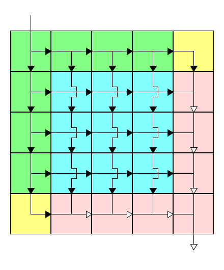

برنامه‌ای بنویسید که ساختار یک ماشین جادویی و یک رشته را ورودی بگیرد، و سپس بگوید که ماشین جادویی چه بلایی سر رشته‌ی ورودی می‌آورد.



در شکل بالا **فلش‌های سیاه (تابع سیاه)** نشان‌دهنده‌ی تابع‌هایی هستند که یک رشته، ورودی می‌گیرند و یک رشته، خروجی می‌دهند و **فلش‌های سفید (تابع سفید)** نشان‌دهنده‌ی تابع‌هایی هستند که دو رشته، ورودی می‌گیرند و یک رشته، خروجی می‌دهند.

ماشین جادویی همیشه یک مربع `n * n` است. نوع خانه‌های آن به شرح زیر هستند:

**خانه‌ی سبز**: این خانه‌ها ضلع بالایی و چپی ماشین را تشکیل می‌دهند و حاوی یک تابع سیاه هستند و هر ورودی‌ای که از بالا یا چپ دریافت کنند را، بعد از اِعمال تابع بر روی آن، به خانه‌ی راستی و پایینی خود منتقل می‌کنند.

**خانه‌ی زرد**: این خانه‌ها صرفاً در گوشه‌ی بالا-راست و پایین-چپ ماشین قرار دارند و حاوی یک تابع سیاه هستند و بعد از اعمال آن بر روی ورودی، آن را به خانه‌‌ی پایینی یا راستی خود می‌دهند.

**خانه‌ی آبی**: این خانه‌ها، خانه‌های درونی ماشین را تشکیل می‌دهند. آن‌ها نیز حاوی **یک** تابع سیاه هستند. اما آن‌را بر روی دو ورودی خود اعمال می‌کنند. به این معنی که ورودی‌ای که از خانه‌ی بالایی می‌آید را، بعد از اعمال تابع، به خانه‌ی پایینی می‌دهند و ورودی‌ای که از چپ می‌آید، بعد از اعمال تابع بر روی آن، به خانه‌ی راستی.

**خانه‌ی صورتی**: این خانه‌ها ضلع راستی و پایینی ماشین را تشکیل می‌دهند. آن‌ها حاوی یک تابع از نوع سفید هستند. تابع را بر روی ورودی‌ای که از خانه‌ی بالایی و چپی می‌گیرند اعمال می‌کنند و به خانه‌ی پایین یا راستی می‌دهند.

ورودیِ کل ماشین به خانه‌ی **بالا-چپ** داده می‌شود و خروجیِ خانه‌ی **پایین-راست**، خروجیِ کل ماشین است.

هنگام دادن ورودی به تابع‌های سفید، **ابتدا ورودی چپ و سپس ورودی بالا** داده می‌شود.


لیست تابع‌ها به شرح زیر هستند:


### تابع‌های سیاه:

1. یک رشته ورودی می‌گیرد و آن را وارونه می‌کند.  
   amir -> rima
2. یک رشته ورودی می‌گیرد و هر کاراکتر آن را تکرار می‌کند.  
   amir -> aammiirr
3. یک رشته ورودی می‌گیرد و آن را تکرار می‌کند.  
   amir -> amiramir
4. یک رشته ورودی می‌گیرد و آن را یک کاراکتر به سمت راست شیفت می‌دهد.  
   amir -> rami
5. یک رشته ورودی می‌گیرد و هر کاراکتر آن را با کاراکتر هم‌شماره‌ی آن از انتهای حروف الفبا جابه‌جا می‌کند.  
   amir -> znri

### تابع‌های سفید:

1. دو رشته ورودی می‌گیرد و حروف آن‌ها را لای هم قرار می‌دهد، حرف اول آن، حرف اول ورودی اول خواهد بود و اگر طول رشته‌ها با هم تفاوت کنند کاراکترهای رشته‌ی بلندتر را کنار هم قرار می‌دهند.  
   amir , pegah -> apmeigrah
2. رشته‌ی دوم را برعکس می‌کند و به انتهای رشته‌ی اول می‌چسباند.  
   amir , pegah -> amirhagep
3. در خروجی تابع، ابتدا حرف اول رشته‌ی اول، سپس حرف آخر رشته‌ی دوم، سپس حرف دوم رشته‌ی اول، سپس حرف یکی مانده به آخر رشته‌ی دوم و … را درج می‌کند.  
   amir , pegah -> ahmaigrep
4. اگر تعداد کاراکترهای رشته‌ی اول زوج بود، رشته‌ی اول را برمی‌گرداند، در غیر اینصورت رشته‌ی دوم را برمی‌گرداند.  
   amir , pegah -> amir
5. هر حرف رشته‌ی اول را با همان حرف از رشته‌‌ی دوم جمع می‌کند و به ۲۶ باقی‌مانده می‌گیرد. اگر طول رشته‌ها متفاوت بود، حرف‌هایی از رشته‌ی بلندتر را که متناظری ندارند، بدون تغییر به خروجی اضافه می‌کند.  
   amir , pegah -> pqorh

## ورودی

در خط اول عدد n وارد می‌شود که مشخص می‌کند ماشین جادویی چند در چند است.  
در n خط بعدی، در هر خط، n عدد بین ۱ تا ۵ وارد می‌شود که مشخص می‌کند در هر خانه‌ی ماشین جادویی چه تابعی قرار دارد.  
در خط بعدی یک رشته از حروف انگلیسی کوچک وارد می‌شود که طول آن بین ۵ تا ۲۰ حرف است.

## خروجی


خروجی برنامه‌ی شما باید یک رشته از حروف انگلیسی کوچک باشد که ماشین جادویی آن را تولید می‌کند.

## مثال

### ورودی نمونه ۱
```
8
2 5 5 4 2 1 5 5 
2 1 2 4 4 1 5 4 
4 4 1 1 1 5 1 4 
4 1 4 4 1 4 5 1 
1 1 1 5 1 4 4 5 
4 4 5 4 5 1 5 5 
1 4 4 4 1 1 1 4 
4 5 4 5 5 1 4 4 
qmiqwnhwnrckeirepjgv
```


### خروجی نمونه ۱
```
vemehewewjijejzjznenancncryrgrlrljjjpjljldedvdtdtmomimumusdsssosodldcdzdzmdmhmvmzizikizizxzxhxzxzpzptpzpzvzvdvzvzrzrirzrzizimizizvzvkvzvzkzktkzkzqzqwqzqztztotzt
```

## راه‌نمایی
برای پیاده‌سازی راحت این مسئله می‌توانید از `interface` کمک بگیرید. به این شکل که دو `interface` زیر را تعریف کنید؛ سپس کلاس‌های مربوط به تابع‌های تعریف شده در صورت سوال (که یکی از این `interface` ها را `implement` می‌کنند) و همین‌طور کلاس‌های مربوط به انواع خانه‌ها (سبز، آبی، زرد و صورتی) را پیاده‌سازی کنید و تابعی بنویسید که یک ماشین جادویی (آرایه‌ای ۲ بعدی از خانه‌ها) را به همراه یک رشته ورودی بگیرد و حاصل را به دست بیاورد.

```java
public interface BlackFunction {
	public String func(String arg);
}

public interface WhiteFunction {
	public String func(String arg1, String arg2);
}
```
